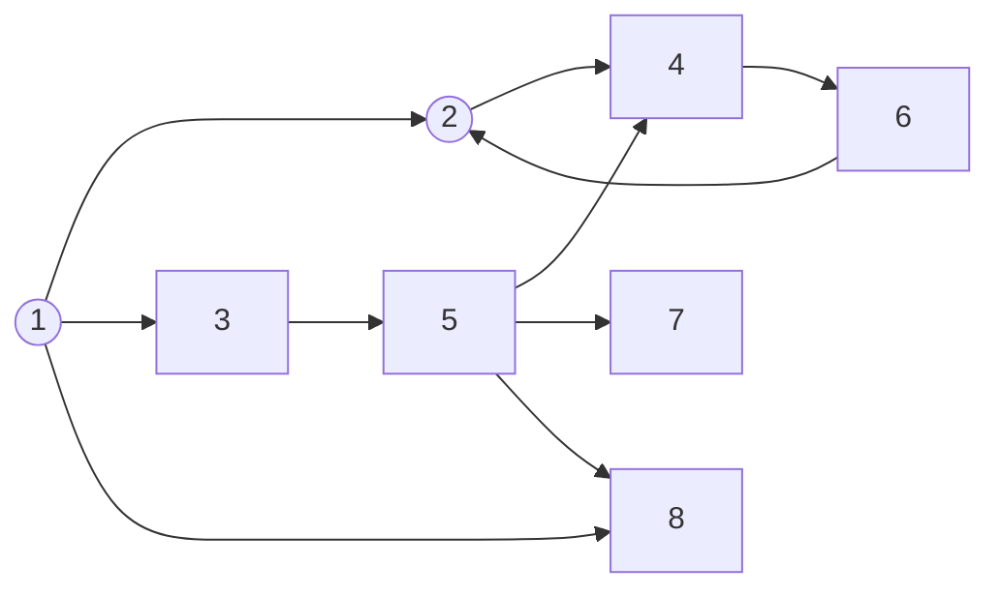

# 🕸 Tarjans Algorithm Simulation
> Backend side of SCC and Bridges Finder using Tarjans Algorithm with React Typescript and Golang

## General Information
This program is created to find s Strongly Connected Component (SCC) on a directed Graph and Bridges on a undirected graph based on user input. The program will proceed a.txt file which containt directed adjacency lists to interpret a graph, then find the SCC and Bridges using popular SCC algorithm, Tarjans. User can also modify the graph by adding and deleting edges by filling the form. The program also provide a good graph and edge coloring to make a better undersanding about the results. Furthermore, the project information is also provided for future improvements.

## Project Structure
```bash
.
├─── algorithm
│   └─── algorithm.go
├─── middleware
│   └─── handlers.go
├─── router
│   └─── router.go
├─── go.mod
├─── go.sum
├─── main.go
└─── README.md
```

## Prerequisites
- gorilla/mux (v 1.8.0) to handle routing
- time to hanlde processing time
- io/ioutil to unmarshal request body
- net/http to handle request and responseWriter
- encoding/json to parse the json POST body

## Algorithms
Thus section will explain what is Tarjans Algorithm and how it used to detect Strongly Connected Components (SCC) on directed graph and bridges on undirected graph.
### What is Tarjans Algorithm
Tarjan's algorithm is a graph traversal algorithm developed by Robert Tarjan in 1972. It is used to find strongly connected components (SCCs) in a directed graph. SCCs are subgraphs in which there is a path between any two vertices.

Tarjan's algorithm is based on depth-first search (DFS) and uses a concept called the "low-link value" to determine SCCs. The algorithm assigns a unique identifier called a "DFS number" to each vertex during the DFS traversal. It also maintains a stack of vertices that are currently being explored.
### How do the algorithm work
1. Start with an unvisited vertex and initiate a DFS traversal from that vertex.
2. Assign a DFS number to the current vertex and set its low-link value to the DFS number.
3. Push the current vertex onto the stack.
4. Explore all the neighbors of the current vertex. If a neighbor has not been visited, recursively traverse it using DFS and update the low-link value of the current vertex if necessary.
5. After exploring all the neighbors, if the low-link value of the current vertex is equal to its DFS number, then it is the root of an SCC. Pop vertices from the stack until the current vertex is reached, and add the popped vertices to the SCC.
6. Repeat steps 1-5 for any unvisited vertices until all vertices have been visited.

At the end of the algorithm, the algorithm outputs the SCCs found in the graph.
### Algorithm time complexity
Tarjan's algorithm has a same time complexity as DFS, $O(V + E)$, where $V$ is the number of vertices and $E$ is the number of edges in the graph.
### Edges classification
Consider there are graph as following

And doing DFS process from edge 1, then
1. <b>Tree Edge</b> is an edge which is present in the tree obtained after applying DFS on the graph. In the example above, the tree edge is 1->2, 2->4, 4->6, 1->3, 3->5, 5->7, 5->8. 
2. <b>Forward Edge</b> is an edge $(u, v)$ such that $v$ is a descendant but not part of the DFS tree. In the example above, 1->8 is a forward edge. 
3. <b>Back edge</b> is an edge $(u, v)$ such that $v$ is the ancestor of node $u$ but is not part of the DFS tree. In the example above, 6->2 is a back edge. Presence of back edge indicates a cycle in directed graph. 
4. <b>Cross Edge</b> is an edge that connects two nodes such that they do not have any ancestor and a descendant relationship between them. In the example above, 5->4 is a cross edge.
### Tarjans Modification
Tarjans Algorithm should be simply modified to find all bridges in the graph. Bridges, also known as cut edges, are the edges in a graph whose removal increases the number of connected components. In other words, if a bridge edge is removed, the graph will become more disconnected.

To find bridges in a graph, Tarjan's algorithm could be extended by adding an additional step during the DFS traversal. Here is the detail
1. Iterate over each neighbor $v$ of vertex $u$:
2. If $v$ is not visited, 
   1. recursively visit it 
   2. Update ```lowLinks[u]``` with the minimum of ```lowLinks[u]``` and ```lowLinks[v]```.
   3. If ```lowLinks[v]``` is greater than ```indices[u]``` or ```lowLinks[u]``` is greater than ```indices[v]``` (must check both due to undirected graph), it means that the edge $(u, v)$ is a bridge. Add it to the bridges list.
3. Else if $v$ is visited and $v$ is not the parent of $u$ then update ```lowLinks[u]``` with the minimum of ```lowLinks[u]``` and ```disc[v]```.

## How to Compile and Run the Program
Clone this repository from terminal with this command
``` bash
$ git clone https://github.com/mikeleo03/Tarjans-Algorithm-Simulation_Backend.git
```
### Run the application on development server
Compile by running the following *command*
``` bash
$ go run main.go
```
If you do it correctly, the pogram should be running on localhost:8080.

## References
https://en.wikipedia.org/wiki/Tarjan%27s_strongly_connected_components_algorithm
https://www.baeldung.com/cs/scc-tarjans-algorithm
https://www.thealgorists.com/Algo/GraphTheory/Tarjan/SCC

## Contributors
<a href = "https://github.com/mikeleo03/markdown-editor/graphs/contributors">
  
</a>